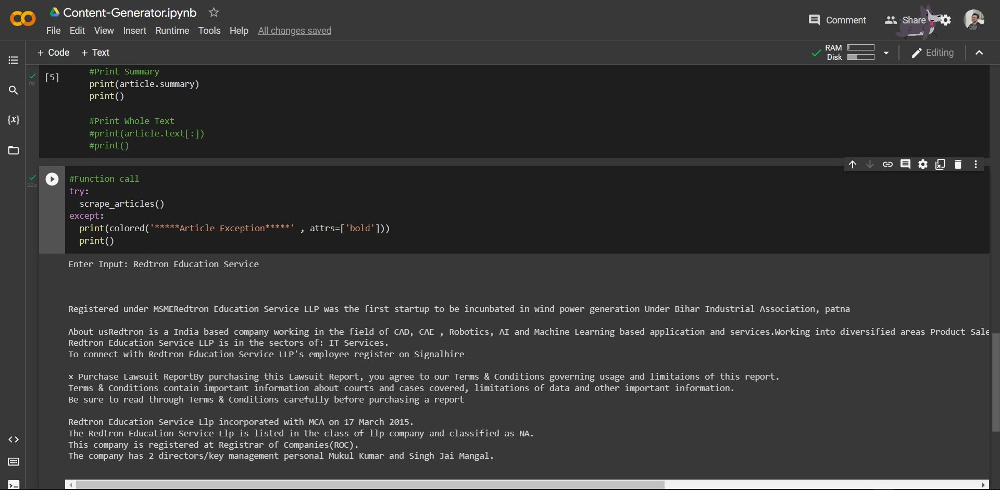

# Content Generator
Content Generator is one of the projects developed during RedTron Internship.

## Instructions:

1. Open the Link : https://colab.research.google.com/drive/1dwMinx78v5y3fajUPH9nAnOdHBPFZLjN
       &ensp; OR  
   &ensp; Run this Code <a href='open.py' target='_blank'>open.py</a>  
 
2. Login to your Google Account, if not logged in.    
   
3.  Now select Runtime > Run All as shown below:    
  
4. Enter the term to be searched, when the search box appears.  
5. Finally, after executing all blocks of code, output is shown.  
A sample output is shown below :    

